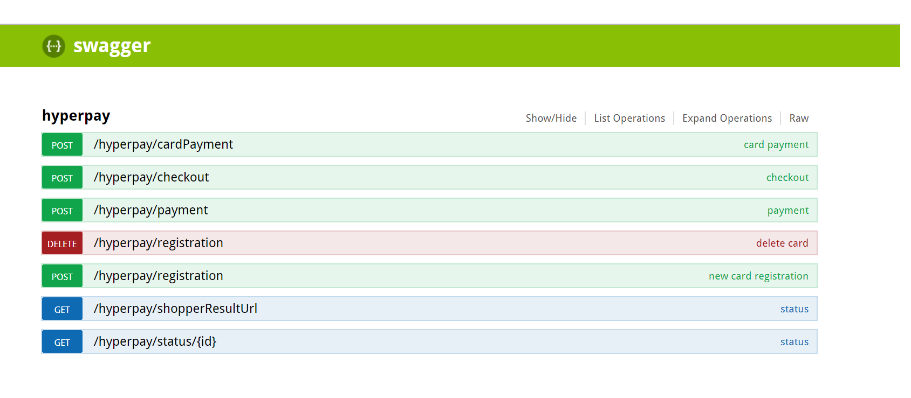
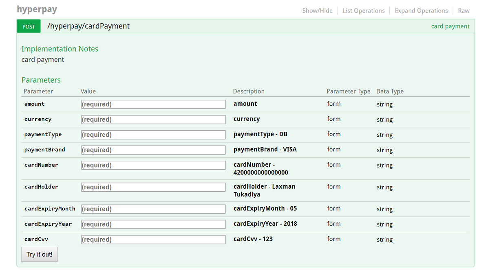
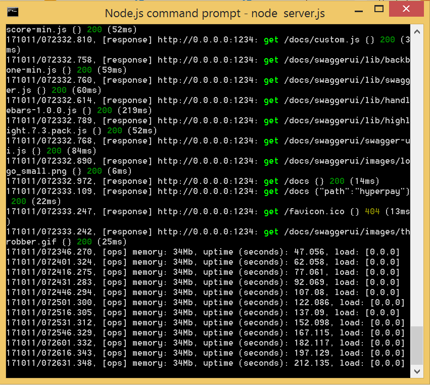

  

  

#hyperPay payment gateway Node-Hapi API source code

#Installation
npm install

#change your credentials in /src/config.json file

#Start the server
node server.js

#Run server on forever mode
forever start server.js

